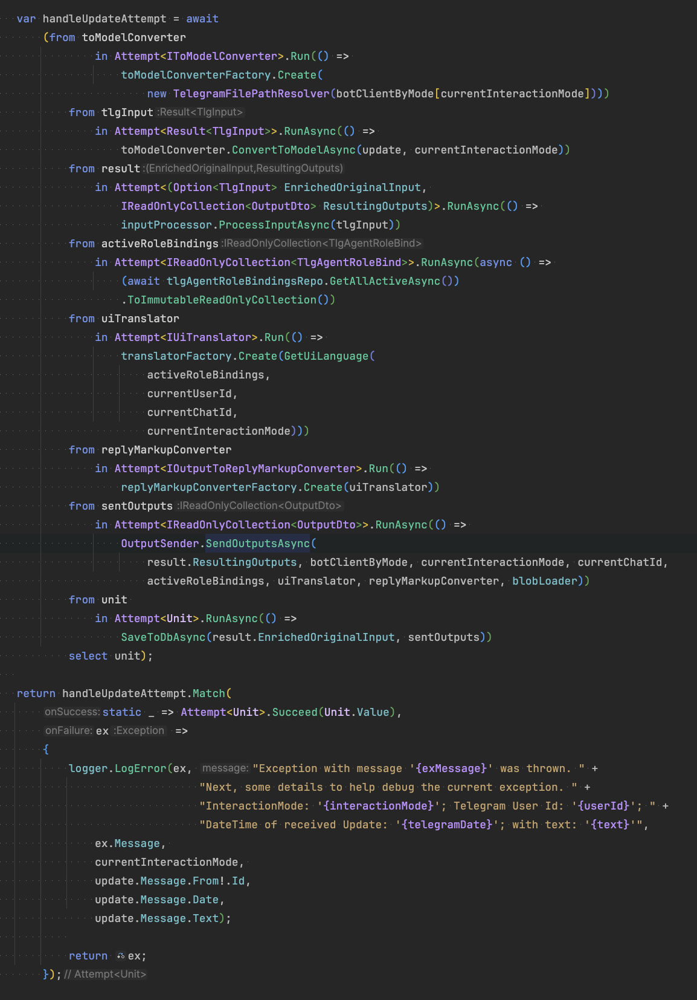

Last Update: 30/06/2025

# Coding Style

For long-lived .NET projects, I generally follow the set of approaches and paradigms described below, to help me guide the development process towards elegant and maintainable code. I'm hoping/attempting to thereby avoid the complexity trap that so easily besets software projects.

# ToC

- [Coding Style](#coding-style)
- [ToC](#toc)
- [Inspirations from](#inspirations-from)
- [Principled Code Design \& Implementation](#principled-code-design--implementation)
  - [SOLID Principles](#solid-principles)
  - [Design by Contract](#design-by-contract)
  - [Composition over Inheritance](#composition-over-inheritance)
    - [Problems with implementation-inheritance](#problems-with-implementation-inheritance)
    - [Solution](#solution)
  - [Explicitness over Conciseness](#explicitness-over-conciseness)
  - [Depth vs Shortness of Functions](#depth-vs-shortness-of-functions)
  - [Dependency Injection](#dependency-injection)
    - [DI Container Libraries](#di-container-libraries)
  - [Aspect-Oriented Programming (AOP)](#aspect-oriented-programming-aop)
- [Mixed Paradigm (OOP ⋃ FP)](#mixed-paradigm-oop--fp)
  - [Extending C# with Monads](#extending-c-with-monads)
    - [1) Instead of nullable reference types: `Option<T>`](#1-instead-of-nullable-reference-types-optiont)
    - [2) For potentially failing operations:  `Result<T>`](#2-for-potentially-failing-operations--resultt)
    - [3) For validation error collections: `Validation<T>`](#3-for-validation-error-collections-validationt)
  - [Monadic Composition in C#](#monadic-composition-in-c)
  - [Combinator Extensions](#combinator-extensions)
    - [Apply](#apply)
    - [Tap](#tap)
    - [Compose](#compose)
    - [Fork](#fork)
    - [Alternate](#alternate)
    - [Transduce](#transduce)
  - [Immutable Collections in C##](#immutable-collections-in-c)
    - [1. What does immutability actually mean in C#?](#1-what-does-immutability-actually-mean-in-c)
    - [2. What are the performance implications of using immutable collections and how to deal with them?](#2-what-are-the-performance-implications-of-using-immutable-collections-and-how-to-deal-with-them)
    - [3. To avoid any potential for dogma or Cargo Cult around this: when do we actually benefit from the use of immutable collections?](#3-to-avoid-any-potential-for-dogma-or-cargo-cult-around-this-when-do-we-actually-benefit-from-the-use-of-immutable-collections)
  - [Guide on Types: Class/Struct/Record](#guide-on-types-classstructrecord)
    - [The 6 Possible Permutations](#the-6-possible-permutations)
    - [Defining Features](#defining-features)

# Inspirations from
- [Clean Code](https://www.goodreads.com/book/show/3735293-clean-code)
- Clean Architecture
    - [Summary](https://blog.cleancoder.com/uncle-bob/2012/08/13/the-clean-architecture.html)
    - [Full Book](https://www.goodreads.com/book/show/18043011-clean-architecture)
- [The Pragmatic Programmer](https://www.goodreads.com/book/show/4099.The_Pragmatic_Programmer)
- [Functional Programming in C#](https://www.goodreads.com/book/show/31550964-functional-programming-in-c)
- [Functional Programming with C#](https://www.goodreads.com/book/show/79735449-functional-programming-with-c)
- [Domain Modeling Made Functional: Tackle Software Complexity with Domain-Driven Design and F#](https://www.goodreads.com/book/show/34921689-domain-modeling-made-functional)
- [FP vs. OO (by Uncle Bob)](https://blog.cleancoder.com/uncle-bob/2018/04/13/FPvsOO.html)
- [John Carmack on Functional Programming in C++](http://sevangelatos.com/john-carmack-on/)
- [Railway Oriented Programming (by Scott Wlaschin)](https://fsharpforfunandprofit.com/rop/)
- [A Philosophy of Software Design vs Clean Code](https://github.com/johnousterhout/aposd-vs-clean-code/blob/main/README.md?utm_source=substack&utm_medium=email)
- [C# in a Nutshell](https://www.goodreads.com/book/show/195616085-c-12-in-a-nutshell)
- [Dependency Injection in .NET](https://www.goodreads.com/book/show/35055958-dependency-injection-in-net)

# Principled Code Design & Implementation

## SOLID Principles

The SOLID principles guide my overall system design & orchestration:

- S = Single Responsibility Principle
- O = Open/Closed Principle
- L = Liskov Substitution Principle
- I = Interface Segregation Principle
- D = Dependency Inversion Principle

## Design by Contract

I somewhat adhere to DbC (originally described by Bertrand Meyer and implemented in the Eiffel language). It ensures that software components interact based on clearly and formally defined agreements on expected inputs, outputs, invariants etc. It complements my testing strategy (see above) to achieve system robustness.

My pragmatic application of DbC means focusing on asserting pre-conditions mainly on the outer edges of modules/components (and especially when interfacing 3rd party libraries). 

**Note that this 'crashing fast and hard' approach represents the exact opposite of the 'defensive programming' anti-pattern**. 

## Composition over Inheritance

In OOP design, I prefer composition over inheritance. 

### Problems with implementation-inheritance
1. OOP Languages are designed with the assumption that sub-typing (for polymorphic use) and implementation sharing (to avoid duplication) go hand-in-hand. That's often true but not always, which is where things break down. 
2. When starting to build class hierarchies, I don't usually have enough foresight to get it right. The deeper the hierarchies grow and the more other modules come to depend on its specifics, the harder it is to change.
3. Sub classes come to depend on specific ways base classes further up the hierarchy implement things, in a way this breaks encapsulation.

### Solution
I avoid conflating sub-typing for polymorphism with implementation sharing for DRY!  
-> For polymorphism, I use interfaces (and avoid using default implementations)  
-> To achieve DRY, I compose objects that offer specific behaviour into the class requiring it.

Exceptions in the name of pragmatism are frequent though, especially in lower level code that other modules won't come to depend on, or when a very flat inheritance hierarchy (e.g. 1 level) is virtually guaranteed. 

## Explicitness over Conciseness

Examples:
1. Configure IDE to suggest or require the `sealed` keyword for classes without inheritors. This way we document the fact and are made aware when we change the design by being forced to remove the keyword. 

2. In the spirit of avoiding premature pessimisation, configure the IDE to require the `static` keyword for anonymous lambdas that don't use a closure over a variable outside of its scope. This allows the compiler to treat it in an optimised way (reducing the load on the GC). 

## Depth vs Shortness of Functions 

I once took the Clean Code position ("the shorter the better" and "do one thing") as gospel but have since realised that this often leads to entanglement of functions and thus increased cognitive load compared to a single, longer but coherent function. 

A more useful framework is John Ousterhout's 'depth' which represents the ratio between a function's complexity (probably correlated by its length) and its interface's complexity. The bigger the ratio in favour of a simple interface, the more complexity the function hides and the more useful it therefore is for the overall design of the system. Shortness, then, is not the actual end-goal. 

## Dependency Injection

I apply Dependency Injection selectively rather than universally. Before deciding how to handle any potential dependency, I apply a necessity test: Can this be a pure function? If yes, I make it a static method, extension method, or local function rather than a class. 

If it needs to be a class, is it an implementation detail (value objects, simple business entities, local utilities, short-lived objects) or an architectural dependency? 

Implementation details can be directly instantiated with `new()` as they're stable collaborators that are genuinely part of the consuming class's natural object model. 

I use constructor injection for architectural dependencies: 
- external systems (databases, APIs, file systems), 
- cross-cutting concerns (logging, caching), 
- complex domain services requiring abstraction, 
- components where I need multiple implementations, or 
- cases requiring mocking for testing. 

Interfaces are justified only when I actually have polymorphic behaviour or need to mock for testing or wrap implementations in Decorators, Virtual Proxies (etc.) — but never solely to enable injection! Thus, when there is no interface, I simply register the concrete type `.AsSelf()`.

Overall, my goal with this approach is maintaining loose coupling and testability where it adds genuine value while avoiding the complexity trap of over-abstraction, unnecessary indirection, and the ["noun bias" problem](https://steve-yegge.blogspot.com/2006/03/execution-in-kingdom-of-nouns.html) where simple actions become wrapped in artificial object hierarchies.

### DI Container Libraries

The above discussion relates only to the *technique* of DI, not to the *technology* facilitating it (i.e. DI Container Libraries). Here, my library of choice is `Autofac` (see [Why Autofac](https://mattburke.dev/why-autofac/)). I avoid 'sophisticated use', where regular business logic can do the job. 

The main motivation for the use of a DI Container is avoiding manual object graph compositions which represent a repetition of the information already contained in constructors. In large projects, I rely on auto-registration enabled by the `Convention over Configuration` pattern. 

## Aspect-Oriented Programming (AOP)

Sounds great in theory, but is prone to over-engineering in practice. For most typical cross-cutting concerns (like *logging*, *error handling*, *validation*, *security*...), I find it easier to stick to very specific and local/targeted implementations. *Auditing* usually comes 'for free' when using Event Sourcing for persistence, which is my default. 

Caching (e.g. for Repositories) has been one of the few examples, where AOP came in handy. I restrict myself to AOP by Design, i.e. no dynamic interception or compile-time weaving, which are mostly useful for legacy projects. 

# Mixed Paradigm (OOP ⋃ FP)

The .NET ecosystem offers the unique luxury to include C# and F# assemblies in a single solution/repository, with lower barriers for interoperability than for any other OOP/FP language pair. Here is how I'd ideally like to take full advantage of the relative strengths of both languages: 

1 - C# as the solution's main language:  
Great for UI/application development, frictionless integration with third-party libraries and other mainstream OOP tasks

2 - F# as a supplemental language (for naturally well-isolated, pure logic modules):  
Great for functional (sub-)domain modelling, elegant and resilient data transformations/algorithms...

Commercial realities may dictate sticking to C# exclusively though so F# is, in my case, probably reserved for pet projects. But even within my C# assemblies, I follow a mixed paradigm approach, following the mixed-paradigm nature of C# itself. This roughly means blending OOP principles for system organisation at the larger scale (SOLID, Dependency Injection, etc.) with a functional programming style (FP) for most of the actual code construction. 

More specifically, it means avoiding imperative code, mutability and stateful operations whenever feasible and carefully demarcating those classes that require statefulness. To reinforce this pattern I follow the convention of using `record` as my default type and `class` only when statefulness is required. 

This approach reduces side effects, and has made my code more predictable, easier to test and more suitable for concurrency and parallelism. As John Carmack argued so well in [this article](http://sevangelatos.com/john-carmack-on/), there are incremental benefits to be gained from moving towards functional style coding even within a traditional OOP language.

Luckily C# has evolved to include lots of great FP-related facilities and I draw heavily on them: Lambdas, LINQ, pattern matching, switch-expressions etc. To make up for a few still missing facilities in C# - mainly to enable [Railway Oriented Programming](https://fsharpforfunandprofit.com/rop/) (ROP) - I have created a library of light-weight monads (see section below). 

This mixed-paradigm approach requires recognising where to draw the line, i.e. finding the most natural cleavage plane to resolve the inevitable tension between OOP and FP. Currently, some of the more advanced FP concepts like partial application or monadic transformation fall by the wayside in my C# code. At some point I thus even considered the use of [Language-Ext](https://github.com/louthy/language-ext) to move C# even closer to FP but distanced myself from that idea after further deliberation to ...:

a) **avoid** the extreme dependency on such a heavy-weight but only medium-popular library 

b) **avoid** further reduced readability of my C# code for most mainstream .NET devs

c) **avoid** pushing the limits of the paradigm too far, i.e. going too much against the grain of C#  

## Extending C# with Monads

### 1) Instead of nullable reference types: `Option<T>`

`From [8SPHE]`

I apply three simple rules:
  
1. Enable nullable types consistently via `<Nullable>enable</Nullable>` in Directory.Build.props saved in solution root.
2. Very rarely make any types under my control nullable (with the exception of using them for the fields in my monads and a few other low-level/technical code exceptions).
3. Instead, use `Option<T>` for any optional T, especially for Ts representing domain concepts.
  
### 2) For potentially failing operations:  `Result<T>`

Encapsulates the return value of an operation that might either succeed or result in an exception or a user-facing error message. It uses a discriminated union for the failure state which can either be an `Exception` or a handled `BusinessError` (with a meaningful and localised message to the user). The DU is implemented with an abstract `Failure` class. In the `Match()` clause where I handle the `onFailure` case I use a `switch expression`, where needed, to treat these two types of failures differently.  

### 3) For validation error collections: `Validation<T>`

Encapsulates a collection of validation results/errors (e.g. to show a user everything that was wrong with their input). Only relevant in some projects.
  
## Monadic Composition in C#

Combined with .NET's `Task<T>` and `IEnumerable<T>`, these custom elevated types lend themselves for elegant monadic compositions and Railway Oriented Programming with the LINQ comprehension/query syntax (yes, I had to extend them with SelectMany() ('Bind' in FP-speak) overloads) - leading to workflows like the one below, which are declarative, fault-tolerant and, I find, so much more expressive compared to traditional, imperative style coding!

## Combinator Extensions

I use the following combinators as part of my custom language extensions for elegant composition of functions and transformations:

### Apply
`Apply<TIn, TOut>(this TIn @this, Func<TIn, TOut> f)` - Transforms a value by applying a function to it, enabling function application as an extension method for more readable, left-to-right function composition.

### Tap
`Tap<T>(this T @this, Action<T> sideEffect)` - Executes a side effect on a value while returning the original value, useful for logging, debugging, or monitoring values in the middle of function pipelines.

### Compose
`Compose<TIn, TOldOut, TNewOut>(this Func<TIn, TOldOut> @this, Func<TOldOut, TNewOut> f)` - Combines two functions by piping the output of the first into the input of the second, creating a new function that represents their composition.

### Fork
`Fork<TIn, T1, T2, TOut>(this TIn @this, Func<TIn, T1> f1, Func<TIn, T2> f2, Func<T1, T2, TOut> joinFunc)` - Processes a single value in multiple independent ways before joining the results, enabling parallel transformation paths that converge to a final result.

### Alternate
`Alternate<TIn, TOut>(this TIn @this, params Func<TIn, TOut>[] altFuncs)` - Tries a series of functions sequentially until one succeeds, providing fallback mechanisms when operations might fail or return `null`/`None`.

### Transduce
`Transduce<TIn, TFilterOut, TFinalOut>(this IEnumerable<TIn> @this, Func<IEnumerable<TIn>, IEnumerable<TFilterOut>> transformer, Func<IEnumerable<TFilterOut>, TFinalOut> aggregator)` - Combines transformation and aggregation operations on collections into a single step, optimizing memory usage by avoiding the creation of intermediate collections.

## Immutable Collections in C##

In line with FP, I design for many of my collections (Lists, Sets, Dictionaries...) to be immutable. Immediately, three issues/questions arise though:

### 1. What does immutability actually mean in C#?

In my mind, there are three aspects of immutability in a collection that are completely orthogonal and thus need to be treated separately. Let's explore by starting out with the obvious choice of `ImmutableList<T>`...

**Aspect-1: Immutability of Items** 

The items of our ImmutableList are not necessarily immutable themselves. If their properties can freely be mutated, would you still call the list immutable? At the least that is misleading. To ensure immutability of the items themselves, their properties' `set` access modifier should be `init` or at least `private set`. In C# a `record` created with positional properties by default use `init` and is therefore immutable (not considering non-destructive mutation via the `with` keyword). I therefore use records by default. 

**Aspect-2: Immutability of the Collection Object**

Developers can still call `.Add()` or `.Remove()` on our ImmutableList for non-destructive mutation. This protects the underlying (original) object which helps e.g. with thread safety and often is one of the main objectives.

**Aspect-3: Conceptual Immutability of the Collection**

What if the intended immutability is about protecting against other developers' ability to perform  non-destructive mutation? That might be called for in case the collection represents some immutable concept whose integrity must be preserved throughout an application's lifetime (e.g. a fixed menu of operations). In this case having `ImmutableList<T>` as the underlying type is not sufficient and the API needs to, at least, expose / return it via the `IReadOnlyList<T>` interface, which doesn't offer developers mutation methods. It offers no guarantee, however, because a downcast e.g. to IList<T> is possible, making mutation methods available again. In rare cases, when a real guarantee is needed, the underlying collection would have to be wrapped in a `ReadOnlyCollection` type which can't be downcast.

In case of Sets and Dictionaries, a `FrozenSet` and `FrozenDictionary` can be used since .NET 8 which also don't offer mutation methods. 

### 2. What are the performance implications of using immutable collections and how to deal with them?

Writing to and reading from an `ImmutableList<T>` is one to two orders of magnitudes slower than `List<T>`, for large collections this can be significant. If we know that no (or hardly no) writes are needed, an `ImmutableArray<T>` offers full, mutable read performance (and even more terrible write performance). 

If we need a Set or Dictionary instead of a List and no writing is needed then `FrozenSet` and `FrozenDictionary` (from .NET 8) offer highly optimised read performance. And when batch mutating any immutable type (e.g. in a loop), simply use the `Builder` before converting back to the immutable type. 

In conclusion, I carefully choose the appropriate type/pattern in the spirit of avoiding premature pessimisation. 

### 3. To avoid any potential for dogma or Cargo Cult around this: when do we actually benefit from the use of immutable collections?

I have come to the conclusion that there is no need for using immutability for locally scoped, private collections which are not passed to other modules and where there is no chance of multi-threaded / shared access (e.g. in single threaded code within a object scoped within a single function invocation). This description may well fit a large majority of collections in a code base. 

When all three of the following conditions are met, it is sufficient to call `.AsReadOnly` on a normal, mutable collection before passing it over a module boundary:  
- a) 'Aspect-3' conceptual immutability needs to be enforced/guaranteed in the calling code AND  
- b) the home class of this collection needs to retain the ability to modify the original collection OR the performance OR code conciseness of default mutable collections are desired AND  
- c) thread-safety is of no concern because it is guaranteed that the calling/consuming code runs on the same thread as the home class

In all other cases, I use immutable collections (covering an appropriate selection from the three immutability aspects described above). Examples where it's especially relevant are:
- when passing collections across module/class boundaries and 'Snapshot Semantics' are thus desirable
- when there is a chance for multi-threaded access without any synchronisation
- when representing events from an Event Sourcing datastore
- when efficient equality comparisons are needed (once computed hash codes can simply be cached)

## Guide on Types: Class/Struct/Record

C# offers a rich selection of types and it wasn't obvious to me how to choose best to support my FP-oriented, mixed paradigm approach to programming. Leaving aside fairly clear cut types like `interface` and `enum`, I have created the following guide  to help me choose appropriately between `class`, `struct`, `record`, `record struct` and the use of the `readonly` modifier on structs. 

This guide is based on the underlying insight of the orthogonality between these keywords (as reflected in the following tables).

### The 6 Possible Permutations

|           | class | struct | readonly struct |
|-----------|-------|--------|-----------------|
| default   | d-c   | d-s    | d-rs            |
| record    | r-c   | r-s    | r-rs            |

### Defining Features

Notes:
- Structs go on the stack only if they are not a member of a reference type. In that case they are stored on the heap together with its home object. 
- All record types are pure compile-time constructs. They compile down to regular classes or structs plus additional synthesised convenience members (like `ToString()` for pretty printing, a deconstructor, and the methods needed for non-destructive mutation).
- Careful: counter-intuitively, `record structs` are fully mutable when not used with the `readonly` keyword. 

